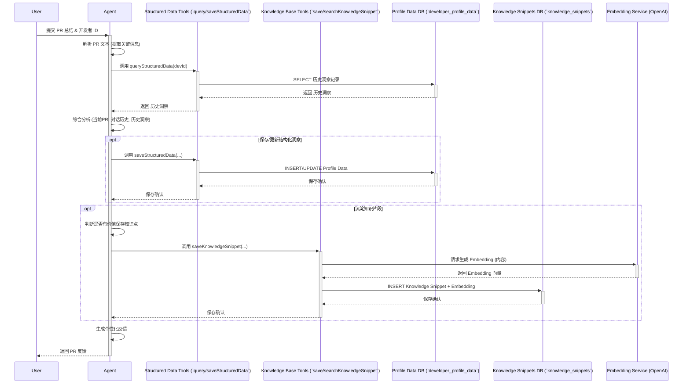
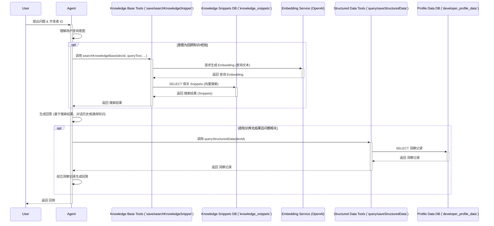

# 开发计划：个人开发者助手 (渐进式)

**核心目标:** 构建一个能基于 PR 总结和历史交互，提供精准反馈、识别优势、沉淀知识的智能助手。

**总体原则:**

- **迭代开发**: 按阶段推进，每个阶段交付可用功能。
- **价值驱动**: 优先实现对开发者最有价值的核心功能。
- **反馈循环**: 在每个阶段后收集反馈，调整后续计划。
- **技术验证**: 在投入大量开发前，先验证关键技术（如数据存储、检索、Agent 指令效果）。

---

## 阶段 1: 夯实基础 - 可靠的记忆与语义能力 (已完成)

- **目标**: 确保 Memory 组件配置正确，为后续结构化存储和语义搜索打下坚实基础。验证 Agent 能否利用基本历史信息。
- **关键任务**:
  1.  **确认 Embedder 配置**:
      - 在 `memory.ts` 中明确配置 `embedder: openai.embedding('text-embedding-3-small')`。
      - 确保相关的 API Key 等环境变量设置正确。
  2.  **验证数据库 Schema**:
      - 使用 `psql` 或其他工具连接数据库。
      - 执行 `\d your_message_table_name` (替换为实际表名) 或使用 SQL 查询。
      - **确认**存在 `vector` 类型的列，并且其维度**精确匹配** 'text-embedding-3-small' 的维度 (1536)。
  3.  **配置 Semantic Recall (可选但推荐)**:
      - 在 `memory.ts` 的 `options` 中，将 `semanticRecall` 设置为 `true` 或具体配置如 `{ topK: 3 }` (如果需要)。
- **产出**: 一个 Memory 配置正确、技术上能支持向量存储和检索的基础 Agent。消除了之前的技术报错。
- **状态**: **已完成并通过验证。**

---

## 阶段 2: 核心结构化 - 问题模式与技术优势 (已完成)

- **目标**: 实现精准的问题模式跟踪 (对应功能 #1 避坑指南) 和技术优势识别 (对应功能 #4)，为开发者建立可靠、可查询的结构化档案。
- **开发思路与细节梳理**:

  - **实现方式**: 选择通过 **Agent Tools** (`saveStructuredDataTool`, `queryStructuredDataTool`) 来封装数据库交互逻辑，而不是创建独立的后端 API，保持逻辑内聚。
  - **数据库设计**: 采用**单一表** (`developer_profile_data`) 来存储两种洞察类型（问题 `issue` 和优势 `strength`），通过 `insight_type` 列进行区分。表结构设计[见./table/create-profile-data.sql](./table/create-profile-data.sql)

  - **存储逻辑 (`saveStructuredDataTool`)**: 工具负责接收 Agent 识别出的洞察数据。核心逻辑是先**查询**数据库判断是否存在基于 `developer_id`, `insight_type`, `category_or_area`, `description` 的相似记录。若存在，则**更新**该记录的 `frequency`, `last_seen_at` 并合并 `related_prs`；若不存在，则**插入**新记录。_注意：当前基于 `description` 的精确匹配可能过于严格，未来可考虑优化此匹配逻辑或将判断交给 Agent_。
  - **查询逻辑 (`queryStructuredDataTool`)**: 工具接收 `developer_id` 和可选的 `filters`，通过动态构建 SQL `WHERE` 子句执行**精确查询** (不使用向量搜索)，返回匹配的结构化记录列表，按 `last_seen_at` 降序排列。
  - **Agent 指令更新 (`instruction.ts`)**: 已更新指令，明确要求 Agent 在分析后调用 `queryStructuredDataTool` 获取历史，并在综合判断后可选地调用 `saveStructuredDataTool` 保存或更新洞察。生成最终反馈时，强调**优先基于查询到的结构化数据**。

* **产出**: Agent 能够通过工具可靠地记录、查询和利用结构化的开发者问题模式与优势，反馈更加精准、一致。开发者画像具备了结构化基础。
* **状态**: **已完成并通过测试验证。**

  - **测试示例 (Test Cases)**:
    - **`saveStructuredDataTool`**:
      - **Case 1: 创建新 Issue**
        - 输入 Context:
        ```json
        {
          "context": {
            "dataToSave": {
              "developer_id": "dev_gijela_test_001",
              "insight_type": "issue",
              "category_or_area": "错误处理",
              "description": "在异步函数中未对 await 调用进行 try/catch 包装",
              "status": "active"
            },
            "currentPrId": "PR-TEST-101"
          }
        }
        ```
        - 预期行为: 在 `developer_profile_data` 表插入新记录，frequency=1, related_prs=["PR-TEST-101"], status='active'。
      - **Case 2: 更新现有 Issue (使用与 Case 1 相同的 description)**
        - 输入 Context:
        ```json
        {
          "context": {
            "dataToSave": {
              "developer_id": "dev_gijela_test_001",
              "insight_type": "issue",
              "category_or_area": "错误处理",
              "description": "在异步函数中未对 await 调用进行 try/catch 包装"
            },
            "currentPrId": "PR-TEST-102"
          }
        }
        ```
        - 预期行为: 更新 Case 1 创建的记录，frequency=2, related_prs=["PR-TEST-101", "PR-TEST-102"], last_seen_at 更新。
      - **Case 3: 创建新 Strength**
        - 输入 Context:
        ```json
        {
          "context": {
            "dataToSave": {
              "developer_id": "dev_gijela_test_001",
              "insight_type": "strength",
              "category_or_area": "TypeScript 类型系统",
              "description": "能够熟练运用泛型和条件类型来增强代码的类型安全性和复用性",
              "confidence": 0.85
            },
            "currentPrId": "PR-TEST-103"
          }
        }
        ```
        - 预期行为: 插入新的 strength 记录，frequency=1, related_prs=["PR-TEST-103"], confidence=0.85。
    - **`queryStructuredDataTool`** (假设上述 save 操作已按顺序执行):
      - **Case 1: 查询开发者所有记录**
        - 输入 Context:
        ```json
        {
          "context": {
            "developer_id": "dev_gijela_test_001"
          }
        }
        ```
        - 预期输出 (`results`): 返回包含 Case 3 (Strength) 和 Case 1/2 (Issue, 已更新) 的记录数组，按 `last_seen_at` 降序排列。
      - **Case 2: 查询开发者所有 Issue**
        - 输入 Context:
        ```json
        {
          "context": {
            "developer_id": "dev_gijela_test_001",
            "filters": {
              "insight_type": "issue"
            }
          }
        }
        ```
        - 预期输出 (`results`): 只返回 Case 1/2 (Issue) 的记录。
      - **Case 3: 查询特定类别的 Issue**
        - 输入 Context:
        ```json
        {
          "context": {
            "developer_id": "dev_gijela_test_001",
            "filters": {
              "insight_type": "issue",
              "category_or_area": "错误处理"
            }
          }
        }
        ```
        - 预期输出 (`results`): 只返回 Case 1/2 (Issue) 的记录。

---

## 阶段 3: 知识库构建 - 解决方案沉淀与回顾 (已完成)

- **目标**: 实现个人知识库的自动沉淀和快速回顾 (对应功能 #3)，使 Agent 能够存储和检索开发者过往的解决方案和经验。
- **开发思路与细节梳理**:
  - **数据库设计**:
    - 创建新表 `public.knowledge_snippets` 用于存储知识片段。
    - **表结构**: [见./table/create-knowledge-snippets.sql](./table/create-knowledge-snippets.sql)
    - **关键索引**:
      - 为 `developer_id` 创建 B-tree 索引 (`idx_knowledge_snippets_developer_id`) 以优化按开发者过滤。
      - 为 `embedding` 创建 HNSW 向量索引 (`idx_knowledge_snippets_embedding_hnsw` 使用 `vector_l2_ops`) 以支持高效的 L2 距离相似度搜索。依赖 `pgvector` 扩展。
      - 可选为 `topic` 和 `created_at` 创建索引。
  - **后端/工具 - 存储逻辑**:
    - 创建新的 Agent Tool `saveKnowledgeSnippetTool` (位于 `tools/saveKnowledgeSnippetTool.ts`)。
    - **职责**: 接收 Agent 提炼的知识点数据 (`developer_id`, `content_summary`, 可选 `topic`, `source_pr` 等)。
    - **核心逻辑**:
      1. 使用共享的 `openaiEmbeddingModel` (来自 `model-provider/openai`，基于 `text-embedding-3-small`) 为 `content_summary` 生成 1536 维 embedding。
      2. 使用共享的 `pg` 连接池将文本数据和生成的 embedding 向量存入 `knowledge_snippets` 表。
  - **后端/工具 - 知识搜索逻辑**:
    - 创建新的 Agent Tool `searchKnowledgeBaseTool` (位于 `tools/searchKnowledgeBaseTool.ts`)。
    - **职责**: 接收用户查询 (`developer_id`, `queryText`, 可选 `topK`, `topicFilter`)，执行语义搜索。
    - **核心逻辑**:
      1. 使用共享的 `openaiEmbeddingModel` 为 `queryText` 生成 embedding。
      2. 构建 SQL 查询，使用 `pgvector` 的 L2 距离操作符 (`<->`) 计算查询 embedding 与表中记录 embedding 的相似度。
      3. 查询时**必须**按 `developer_id` 过滤，可选按 `topic` 精确匹配过滤。
      4. 按 `similarity_score` (L2 距离) **升序**排序，并使用 `LIMIT` 限制返回 `topK` 条结果。
      5. 返回包含 `id`, `content_summary`, `topic`, `source_pr`, `created_at` 以及 `similarity_score` 的结果列表。
  - **Agent 指令更新 (`instruction.ts`)**:
    - 在 `# 可用工具` 部分添加了 `saveKnowledgeSnippet` 和 `searchKnowledgeBase`。
    - 增加了处理 PR 总结报告的 `流程 A` 中的 `步骤 A5.5: 提炼并保存知识片段 (可选)`，指导 Agent 在分析 PR 后，判断是否有价值保存知识点，并调用 `saveKnowledgeSnippetTool`。
    - 新增了处理用户直接提问的 `流程 B`，指导 Agent 理解用户回顾性查询意图，调用 `searchKnowledgeBaseTool` 进行搜索，并基于搜索结果生成回答。
  - **测试**:
    - 对 `saveKnowledgeSnippetTool` 和 `searchKnowledgeBaseTool` 进行了单元测试，验证了核心功能（Embedding 生成、数据库交互、向量搜索、过滤）按预期工作。
- **产出**: Agent 具备了将 PR 中的解决方案、经验教训自动沉淀到个人知识库的能力，并能通过自然语言查询快速回顾这些知识。
- **状态**: **已完成并通过测试验证。**
  - **测试示例 (Test Cases)**:
    - **`saveKnowledgeSnippetTool`**:
      - **Case 1: 基本保存**
        - 输入 Context:
          ```json
          {
            "developer_id": "dev_test_user_001",
            "content_summary": "使用 pgvector 的 HNSW 索引可以显著提高大规模向量数据的相似性搜索速度。"
          }
          ```
        - 预期行为: 在 `knowledge_snippets` 表插入新记录，包含 `developer_id`, `content_summary` 和 1536 维 `embedding`，返回 `success: true` 和新记录 `snippetId`。
      - **Case 2: 包含可选字段的保存**
        - 输入 Context:
          ```json
          {
            "developer_id": "dev_test_user_002",
            "content_summary": "在 Node.js 中处理异步操作时，务必对 Promise rejection 进行捕获，例如使用 try/catch 或 .catch()。",
            "topic": "Node.js 异步错误处理",
            "source_pr": "https://github.com/your-org/your-repo/pull/123",
            "extracted_from_section": "代码审查评论"
          }
          ```
        - 预期行为: 在 `knowledge_snippets` 表插入新记录，包含所有提供的信息和 `embedding`，返回 `success: true` 和新记录 `snippetId`。
    - **`searchKnowledgeBaseTool`** (假设上述 save 操作已成功执行):
      - **Case 1: 基本语义搜索 (找到相关结果)**
        - 输入 Context:
          ```json
          {
            "developer_id": "dev_test_user_001",
            "queryText": "如何加速向量查询？",
            "topK": 3
          }
          ```
        - 预期输出 (`results`): 返回包含 Case 1 保存的记录的数组 (ID: 1, content_summary: "...HNSW 索引...")，`similarity_score` 较小。
      - **Case 2: 按主题精确过滤 (找到结果)**
        - 输入 Context:
          ```json
          {
            "developer_id": "dev_test_user_002",
            "queryText": "异步错误怎么处理",
            "topicFilter": "Node.js 异步错误处理"
          }
          ```
        - 预期输出 (`results`): 返回包含 Case 2 保存的记录的数组 (ID: 2, topic: "Node.js 异步错误处理")。
      - **Case 3: 按主题精确过滤 (无结果)**
        - 输入 Context:
          ```json
          {
            "developer_id": "dev_test_user_002",
            "queryText": "异步错误怎么处理",
            "topicFilter": "数据库性能"
          }
          ```
        - 预期输出 (`results`): 返回空数组 `[]`。
      - **Case 4: 搜索其他开发者 (无结果)**
        - 输入 Context:
          ```json
          {
            "developer_id": "dev_test_user_999",
            "queryText": "数据库索引"
          }
          ```
        - 预期输出 (`results`): 返回空数组 `[]`。

---

## 阶段 4: 深度集成与高级功能 (优先级较低，后续规划)

- **目标**: 实现提交前提醒、上下文获取、风险预估等深度集成功能 (对应功能 #2, #5, #6)。
- **关键任务**: (方向性，待细化)
  - 调研/选择集成方案 (IDE 插件/Git Hooks)。
  - 设计 Agent 与集成点的交互。
  - 开发代码 diff 分析 / 集成静态分析工具。
  - 开发 Git 历史分析能力。
  - 设计/实现通知机制。
- **产出**: 将助手能力深度嵌入开发者工作流。
- **风险**: 集成复杂度高；需要额外代码/系统分析能力。

---

**贯穿各阶段的任务:**

- **Prompt Engineering**: 持续优化 `instruction.ts`。
- **测试**: 单元、集成、端到端测试。
- **监控与日志**: 添加必要日志。
- **错误处理**: 确保健壮性。

## 时序图

### 场景一：处理 PR 总结报告 (Workflow A)



### 场景二：回答用户直接提问 (Workflow B)


