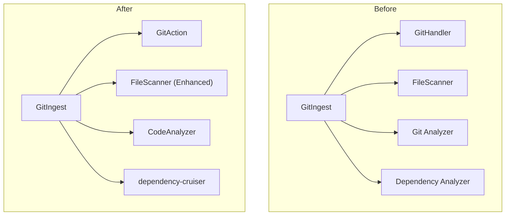
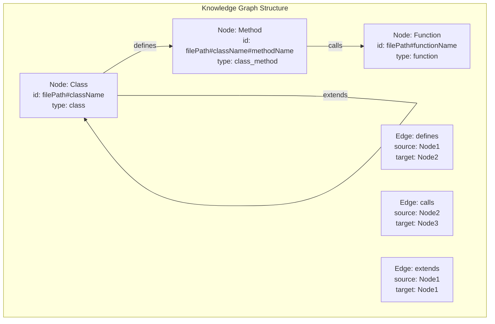
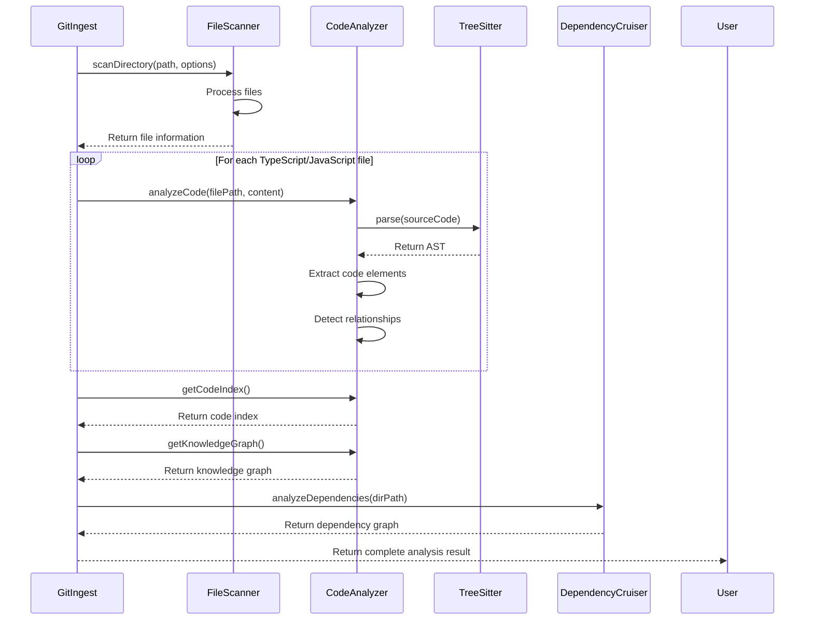

## 输入
请严格按照流程A处理下面的Pr信息: 
1. developer_id: 'test_id2',
2. owner: 'Gijela',
3. repo: 'git-analyze',
4. pull_number: 2,
5. prReportText: "# Pull Request Summary\n\n## Walkthrough\n\nThis PR introduces a comprehensive code analysis system that transforms git-analyze into a powerful repository analysis tool. It adds Tree-sitter based code parsing, knowledge graph construction, and dependency analysis capabilities while removing older, less sophisticated analysis components. The implementation includes a new `CodeAnalyzer` class, improved file scanning, and enhanced token estimation, along with documentation and configuration updates.\n\n## Changes\n\n| Files | Change Type | Summary |\n|-------|------------|---------|\n| `dist/index.d.ts`, `dist/index.js` | feat | Add compiled TypeScript declaration and JavaScript files with interfaces for code analysis and knowledge graph functionality |\n| `src/core/codeAnalyzer.ts` | feat | Implement Tree-sitter based code analyzer that extracts code elements and builds knowledge graphs |\n| `src/core/errors.ts` | refactor | Add descriptive comments and standardize error class naming conventions |\n| `src/core/gitAction.ts` | feat | Replace GitHandler with new GitAction class for Git operations |\n| `src/core/scanner.ts` | refactor | Improve file path handling, add token estimation, and expand binary file type detection |\n| `src/index.ts` | refactor | Update GitIngest to use new CodeAnalyzer, add dependency graph generation, and improve repository cloning |\n| `src/types/index.ts` | refactor | Update type definitions to support code analysis and knowledge graph features |\n| `src/utils/analyzeDependencies.ts` | feat | Add utility for analyzing project dependencies using dependency-cruiser |\n| `src/utils/graphSearch.ts` | feat | Implement knowledge graph search functionality with relationship traversal |\n| `src/utils/index.ts` | refactor | Improve token estimation algorithm and add file size tree generation |\n| `README.md`, `README-zh.md` | docs | Add comprehensive documentation in English and Chinese |\n| `.github/workflows/build_dependency_graph.yml` | ci | Add GitHub Actions workflow for building dependency graphs |\n| `package.json`, `tsconfig.json` | chore | Update package configuration, dependencies, and build settings |\n| `.cursorrules`, `.gitignore` | chore | Add editor configuration and update ignored files |\n| Multiple example files | remove | Delete example implementations and tests that are no longer needed |\n| Multiple dependency analysis files | remove | Remove old dependency analysis implementation replaced by new system |\n| Multiple git analysis files | remove | Remove old git analysis implementation replaced by new GitAction class |\n| Configuration files | remove | Remove configuration files no longer needed with new architecture |\n\n## Architecture Changes\n\n`mermaid\ngraph TD\n    subgraph \"Before\"\n        GitIngest1[\"GitIngest\"]\n        GitHandler[\"GitHandler\"]\n        Scanner1[\"FileScanner\"]\n        GitAnalyzer[\"Git Analyzer\"]\n        DependencyAnalyzer[\"Dependency Analyzer\"]\n        \n        GitIngest1 --> GitHandler\n        GitIngest1 --> Scanner1\n        GitIngest1 --> GitAnalyzer\n        GitIngest1 --> DependencyAnalyzer\n    end\n    \n    subgraph \"After\"\n        GitIngest2[\"GitIngest\"]\n        GitAction[\"GitAction\"]\n        Scanner2[\"FileScanner (Enhanced)\"]\n        CodeAnalyzer[\"CodeAnalyzer\"]\n        DependencyCruiser[\"dependency-cruiser\"]\n        \n        GitIngest2 --> GitAction\n        GitIngest2 --> Scanner2\n        GitIngest2 --> CodeAnalyzer\n        GitIngest2 --> DependencyCruiser\n    end\n`\n\nThe PR significantly refactors the architecture by:\n1. Replacing the old Git handling with a more robust GitAction class\n2. Adding a sophisticated CodeAnalyzer that builds knowledge graphs\n3. Enhancing the FileScanner with better path handling and token estimation\n4. Using dependency-cruiser for more accurate dependency analysis\n5. Removing multiple specialized analyzers in favor of a unified approach\n\n## Code Review\n\n### Critical Issues\n\n#### 1. Memory Leak in CodeAnalyzer\n\n**Path**: `src/core/codeAnalyzer.ts`, line 56-61\n\nThe `CodeAnalyzer` class maintains state in instance variables that accumulate data across multiple file analyses:\n\n\n\nWhile a new analyzer instance is created in `analyzeFromDirectory` (line 185 in `src/index.ts`), there's no mechanism to clear these collections between analyses of different files within the same repository. This will cause memory usage to grow unbounded when analyzing large repositories.\n\nThe class should implement a `reset()` method to clear these collections, or the collections should be reset before analyzing each file.\n\n#### 2. Uncaught Promise Rejection in analyzeDependencies\n\n**Path**: `src/utils/analyzeDependencies.ts`, line 6-19\n\nThe `analyzeDependencies` function catches errors but doesn't properly handle them:\n\n\n\nWhen an error occurs, the function logs it but returns undefined, which will cause unexpected behavior in the calling code. The function should either return a default value (like an empty object) or rethrow the error to allow proper error handling by the caller.\n\n#### 3. Path Traversal Security Vulnerability\n\n**Path**: `src/index.ts`, line 90-97\n\nThe code extracts repository names from URLs without proper validation:\n\n\n\nIf a malicious URL is provided, it could potentially contain characters that would allow directory traversal (e.g., `../`). The repository name should be sanitized to ensure it only contains safe characters before using it to construct file paths.\n\n#### 4. Ambiguous Type Resolution in resolveTypeReference\n\n**Path**: `src/core/codeAnalyzer.ts`, line 636-639\n\nThe `resolveTypeReference` method doesn't handle name collisions properly:\n\n\n\nThis method finds the first element with a matching name, regardless of type or scope. In a large codebase with multiple elements sharing the same name (e.g., different classes or interfaces named \"Config\" in different modules), this will lead to incorrect relationship mapping. The method should consider the context (like the current file or import statements) when resolving type references.\n\n#### 5. Hardcoded Target in Error Class Inheritance Edges\n\n**Path**: `src/utils/graphSearch.ts`, line 115-127\n\nThe code handling inheritance relationships for Error classes has a critical issue where the `target` property is hardcoded as the string 'Error' rather than using `parentNode.id`. This will create invalid edges in the graph if the Error class isn't found or has a different ID format, potentially causing visualization or search issues.\n\n## Knowledge Graph Implementation\n\n`mermaid\ngraph TD\n    subgraph \"Knowledge Graph Structure\"\n        Node1[\"Node: Class\n        id: filePath#className\n        type: class\"]\n        \n        Node2[\"Node: Method\n        id: filePath#className#methodName\n        type: class_method\"]\n        \n        Node3[\"Node: Function\n        id: filePath#functionName\n        type: function\"]\n        \n        Edge1[\"Edge: defines\n        source: Node1\n        target: Node2\"]\n        \n        Edge2[\"Edge: calls\n        source: Node2\n        target: Node3\"]\n        \n        Edge3[\"Edge: extends\n        source: Node1\n        target: Node1\"]\n        \n        Node1 -->|\"defines\"| Node2\n        Node2 -->|\"calls\"| Node3\n        Node1 -->|\"extends\"| Node1\n    end\n`\n\nThe new CodeAnalyzer builds a knowledge graph that represents code structure as nodes (classes, functions, interfaces) and edges (calls, imports, extends, implements, defines). This enables powerful code navigation and relationship analysis that wasn't possible with the previous implementation.\n\n## Analysis Process Flow\n\n`mermaid\nsequenceDiagram\n    participant GitIngest\n    participant FileScanner\n    participant CodeAnalyzer\n    participant TreeSitter\n    participant DependencyCruiser\n    \n    GitIngest->>FileScanner: scanDirectory(path, options)\n    FileScanner->>FileScanner: Process files\n    FileScanner-->>GitIngest: Return file information\n    \n    loop For each TypeScript/JavaScript file\n        GitIngest->>CodeAnalyzer: analyzeCode(filePath, content)\n        CodeAnalyzer->>TreeSitter: parse(sourceCode)\n        TreeSitter-->>CodeAnalyzer: Return AST\n        CodeAnalyzer->>CodeAnalyzer: Extract code elements\n        CodeAnalyzer->>CodeAnalyzer: Detect relationships\n    end\n    \n    GitIngest->>CodeAnalyzer: getCodeIndex()\n    CodeAnalyzer-->>GitIngest: Return code index\n    \n    GitIngest->>CodeAnalyzer: getKnowledgeGraph()\n    CodeAnalyzer-->>GitIngest: Return knowledge graph\n    \n    GitIngest->>DependencyCruiser: analyzeDependencies(dirPath)\n    DependencyCruiser-->>GitIngest: Return dependency graph\n    \n    GitIngest-->>User: Return complete analysis result\n`\n\nThe PR introduces a more sophisticated analysis flow that leverages Tree-sitter for accurate code parsing and builds a comprehensive knowledge graph of code elements and their relationships.\n\nNotes: This PR represents a significant architectural shift for the git-analyze tool, moving from separate specialized analyzers to a unified code analysis approach based on Tree-sitter and knowledge graphs. While the implementation is generally solid, there are several critical issues related to memory management, error handling, and potential security concerns that should be addressed before merging. The PR also removes numerous files that are no longer needed with the new architecture, including example implementations, tests, and older analysis components.\n\nWiki pages you might want to explore:\n- [System Architecture (Gijela/git-analyze)](/wiki/Gijela/git-analyze#2)\n- [CodeAnalyzer (Gijela/git-analyze)](/wiki/Gijela/git-analyze#3.2)"

## 输出

````json
# Pull Request Summary

## Walkthrough

This PR introduces a comprehensive code analysis system that transforms git-analyze into a powerful repository analysis tool. It adds Tree-sitter based code parsing, knowledge graph construction, and dependency analysis capabilities while removing older, less sophisticated analysis components. The implementation includes a new `CodeAnalyzer` class, improved file scanning, and enhanced token estimation, along with documentation and configuration updates.

## Changes

| Files | Change Type | Summary |
|-------|------------|---------|
| `dist/index.d.ts`, `dist/index.js` | feat | Add compiled TypeScript declaration and JavaScript files with interfaces for code analysis and knowledge graph functionality |
| `src/core/codeAnalyzer.ts` | feat | Implement Tree-sitter based code analyzer that extracts code elements and builds knowledge graphs |
| `src/core/errors.ts` | refactor | Add descriptive comments and standardize error class naming conventions |
| `src/core/gitAction.ts` | feat | Replace GitHandler with new GitAction class for Git operations |
| `src/core/scanner.ts` | refactor | Improve file path handling, add token estimation, and expand binary file type detection |
| `src/index.ts` | refactor | Update GitIngest to use new CodeAnalyzer, add dependency graph generation, and improve repository cloning |
| `src/types/index.ts` | refactor | Update type definitions to support code analysis and knowledge graph features |
| `src/utils/analyzeDependencies.ts` | feat | Add utility for analyzing project dependencies using dependency-cruiser |
| `src/utils/graphSearch.ts` | feat | Implement knowledge graph search functionality with relationship traversal |
| `src/utils/index.ts` | refactor | Improve token estimation algorithm and add file size tree generation |
| `README.md`, `README-zh.md` | docs | Add comprehensive documentation in English and Chinese |
| `.github/workflows/build_dependency_graph.yml` | ci | Add GitHub Actions workflow for building dependency graphs |
| `package.json`, `tsconfig.json` | chore | Update package configuration, dependencies, and build settings |
| `.cursorrules`, `.gitignore` | chore | Add editor configuration and update ignored files |
| Multiple example files | remove | Delete example implementations and tests that are no longer needed |
| Multiple dependency analysis files | remove | Remove old dependency analysis implementation replaced by new system |
| Multiple git analysis files | remove | Remove old git analysis implementation replaced by new GitAction class |
| Configuration files | remove | Remove configuration files no longer needed with new architecture |

## Architecture Changes



The PR significantly refactors the architecture by:
1. Replacing the old Git handling with a more robust GitAction class
2. Adding a sophisticated CodeAnalyzer that builds knowledge graphs
3. Enhancing the FileScanner with better path handling and token estimation
4. Using dependency-cruiser for more accurate dependency analysis
5. Removing multiple specialized analyzers in favor of a unified approach

## Code Review

### Critical Issues

#### 1. Memory Leak in CodeAnalyzer

**Path**: `src/core/codeAnalyzer.ts`, line 56-61

The `CodeAnalyzer` class maintains state in instance variables that accumulate data across multiple file analyses:

While a new analyzer instance is created in `analyzeFromDirectory` (line 185 in `src/index.ts`), there's no mechanism to clear these collections between analyses of different files within the same repository. This will cause memory usage to grow unbounded when analyzing large repositories.

The class should implement a `reset()` method to clear these collections, or the collections should be reset before analyzing each file.

*Agent 分析: 此问题与开发者过去在 PR-123 中遇到的 "Memory Leak in CodeAnalyzer" 问题模式相关。建议实现 `reset()` 方法或在每次分析前重置集合。*

#### 2. Uncaught Promise Rejection in analyzeDependencies

**Path**: `src/utils/analyzeDependencies.ts`, line 6-19

The `analyzeDependencies` function catches errors but doesn't properly handle them:

When an error occurs, the function logs it but returns undefined, which will cause unexpected behavior in the calling code. The function should either return a default value (like an empty object) or rethrow the error to allow proper error handling by the caller.

*Agent 分析: 此问题与开发者过去在 PR-123 中遇到的 "Uncaught Promise Rejection in analyzeDependencies" 问题模式相关。建议返回默认值或重新抛出错误。*

#### 3. Path Traversal Security Vulnerability

**Path**: `src/index.ts`, line 90-97

The code extracts repository names from URLs without proper validation:

If a malicious URL is provided, it could potentially contain characters that would allow directory traversal (e.g., `../`). The repository name should be sanitized to ensure it only contains safe characters before using it to construct file paths.

*Agent 分析: 此问题与开发者过去在 PR-123 中遇到的 "Path Traversal Security Vulnerability" 问题模式相关。建议对仓库名称进行严格的字符过滤。*

#### 4. Ambiguous Type Resolution in resolveTypeReference

**Path**: `src/core/codeAnalyzer.ts`, line 636-639

The `resolveTypeReference` method doesn't handle name collisions properly:

This method finds the first element with a matching name, regardless of type or scope. In a large codebase with multiple elements sharing the same name (e.g., different classes or interfaces named "Config" in different modules), this will lead to incorrect relationship mapping. The method should consider the context (like the current file or import statements) when resolving type references.

*Agent 分析: 此问题与开发者过去在 PR-123 中遇到的 "Ambiguous Type Resolution in resolveTypeReference" 问题模式相关。建议在解析类型引用时考虑上下文。*

#### 5. Hardcoded Target in Error Class Inheritance Edges

**Path**: `src/utils/graphSearch.ts`, line 115-127

The code handling inheritance relationships for Error classes has a critical issue where the `target` property is hardcoded as the string 'Error' rather than using `parentNode.id`. This will create invalid edges in the graph if the Error class isn't found or has a different ID format, potentially causing visualization or search issues.

*Agent 分析: 此问题与开发者过去在 PR-123 中遇到的 "Hardcoded Target in Error Class Inheritance Edges" 问题模式相关。建议使用 `parentNode.id` 替代硬编码字符串。*

## Knowledge Graph Implementation



The new CodeAnalyzer builds a knowledge graph that represents code structure as nodes (classes, functions, interfaces) and edges (calls, imports, extends, implements, defines). This enables powerful code navigation and relationship analysis that wasn't possible with the previous implementation.

## Analysis Process Flow



The PR introduces a more sophisticated analysis flow that leverages Tree-sitter for accurate code parsing and builds a comprehensive knowledge graph of code elements and their relationships.

## 个性化建议与总结

### 已保存的知识点
1. **内存管理**: `CodeAnalyzer` 类应实现 `reset()` 方法以防止内存泄漏。
2. **错误处理**: `analyzeDependencies` 函数应返回默认值或重新抛出错误。
3. **安全**: 对仓库名称进行严格的字符过滤以防止路径遍历漏洞。
4. **类型解析**: `resolveTypeReference` 方法应考虑上下文以避免名称冲突。
5. **图搜索**: 在 `graphSearch.ts` 中使用 `parentNode.id` 替代硬编码字符串。

### 总结
此 PR 代表了 git-analyze 工具的重大架构升级，引入了基于 Tree-sitter 和知识图的统一代码分析方法。尽管实现总体稳健，但仍需解决内存管理、错误处理和安全问题。建议在合并前修复这些问题。
````
